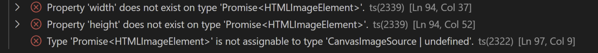

# Glade

[![app version][app-version]][website]
[![License][license-src]][license-href]

A virtual whiteboard

[website]: https://zhengyuzi.github.io/glade/
[app-version]: https://img.shields.io/badge/dynamic/json?url=https%3A%2F%2Fraw.githubusercontent.com%2Fzhengyuzi%2Fglade%2Fmain%2Fglade%2Fpackage.json&query=%24.version&label=glade&labelColor=e5e7eb&color=6b7280
[license-src]: https://img.shields.io/github/license/zhengyuzi/glade.svg?style=flat&colorA=e5e7eb&colorB=6b7280
[license-href]: https://github.com/zhengyuzi/glade/blob/main/LICENSE

---
# Bug 1
---
## How to Run The Code
1. In your terminal, git clone this repository using `git clone https://github.com/n2singh/glade-debug1.git`
2. Open the glade folder in VSCode that you just cloned
3. In VSCode terminal run the following commands:
   
`pnpm install`

`pnpm -r build`

`pnpm -C glade run dev`

`The last command should print a URL like http://localhost:5173/glade/, click that to see the working project in action`

---
## Error Message Shown:

---
## Hints
- look at the type of the elements in the error
- check their return type

